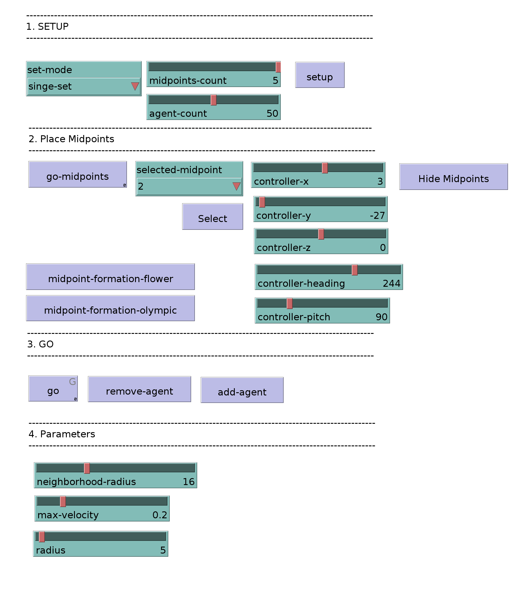
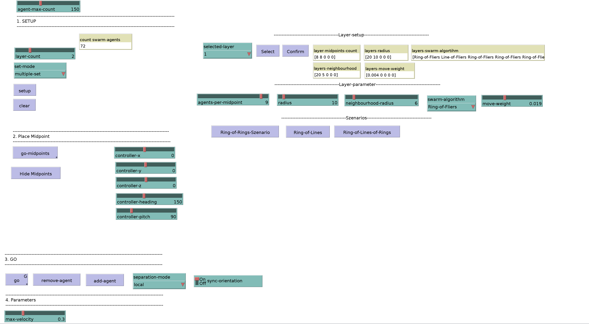

# An Approach for Extended Swarm Formation Flight with Drones: ProteaseX 
# Netlogo Demos
This repository contains the Netlogo models used to evaluate the new concepts of ProteaseX.
A more detailed description of the concepts can be found in the paper

## ProteaseX-MultiInput
This Netlogo model is designed for the evaluation of swarm execution with multiple reference points.

### Setup
The user must first set up the experiment

In the setup process, the user can select the initial number of agents the (**agent-count**) and
the number of midpoints (reference points) (**midpoint-count**). 

The **set-mode** parameter allows the user to choose between two modes:

- **single-set** : In this mode, each agent chooses the nearest reference point for its swarm execution.
- **multiple-set** : In this mode, each agent is assigned to one of the reference points.

To finish the setup, press **setup** to spawn the agents and midpoint with the chosen configuration.  

### Place Midpoints
The user can now place the midpoints in one of two ways:
By using one of the two predefined configurations:
 - **midpoint-formation-flower** for the flower pattern
 - **midpoint-formation-olympic** for the olympic ring pattern

Or by placing them freely:
 - first press **go-midpoints** 
 - select the midpoint to move from the **selected-midpoint** drop down menu.
 - press **Select** 
 - move the midpoint using the **controller-()** sliders
 - press **go-midpoints** again

 ### Go
 To start the experiment, press **Go**.\
 The user can still move the midpoints as described above.\
 **remove-agent** removes one agent from the experiment.\
 **add-agents** spawns one agent. In **multiple-set** mode the agent will be assigned to the same set as its closest agent at the time of spawning.  

 ### Parameters
 The parameters of the Ring-of-Fliers algorithm can be changed with the sliders:  
 - **neighborhood-radius**: the communication radius
 - **max-velocity**: the maximum length of the new flight vector 
 - **radius**: the radius of the Ring-of-Fliers

## ProteaseX-Layered
This Netlogo model is designed for the evaluation of swarm execution with layers.

### Setup
The user must first set up the experiment

In the setup process, the user can select the number of layers (**layer**)

The **set-mode** parameter allows the user to choose between two modes:

- **single-set** : In this mode, each agent chooses the nearest reference point for its swarm execution.
- **multiple-set** : In this mode, each agent is assigned to one of the reference points.

To set up the layers the user can choose the specific layer via the **selected-layer** drop down menu. Press **Select** and specify the parameters 
with the sliders. The possible parameters are: 
 - **agents-per-midpoint**: The number of agents spawned on Layer i, per agent on the layer i-1. For example if there are 4 agents on layer 0 and and agents-per-midpoint is specified to be 4 on layer 1. 16 Agents will be spawned on layer 1. 
 - **radius**: the radius of the specified swarm algorithm
 - **neighborhood-radius**: the communication radius 
 - **swarm-algorithm**: the swarm algorithm (Ring-of-Fliers/Ball-of-Fliers) 

 
To finish the setup, press **setup** to spawn the agents and midpoint with the chosen configuration.  

### Place Midpoint
The user can now place the midpoint freely:
 - first press **go-midpoints** 
 - move the midpoint using the **controller-()** sliders
 - press **go-midpoints** again

### Go
 To start the experiment, press **Go**.\
 The user can still move the midpoint as described above.\
 **remove-agent** removes one agent from the experiment.\
 **add-agents** Spawns one agent. The layer is assigned to the same layer
 as its closest agent at the time of spawning.  
 In **multiple-set** mode the agent will also be assigned to the same set as its closest agent at the time of spawning.   

With the **separation-mode** dropdown menu the user can influence the separation urge in the Ring-of-Fliers/Ball-of-Fliers algorithm. 
In **local** mode the agents will only separate from agents on the same layer.
In **global** mode the agents will separate from all agents.

With the **sync-orientation** switch the user can lock the orientation of the Rings on all layers to the orientation of the midpoint

### Parameters
 The parameters of the Ring-of-Fliers algorithm can be changed with the sliders:  
 - **neighborhood-radius**: the communication radius
 - **max-velocity**: the maximum length of the new flight vector 
 - **radius**: the radius of the Ring-of-Fliers

